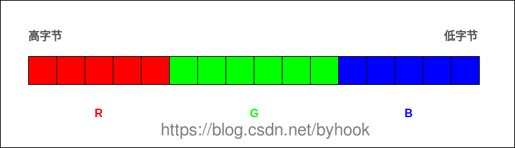
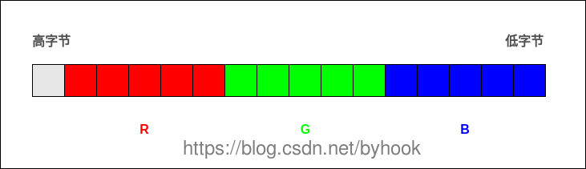
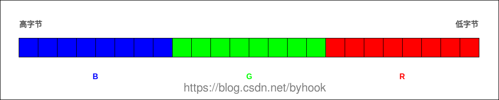
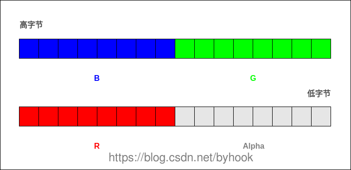

#### rgb

RGB色彩模式`是工业界的一种颜色标准，是通过对红、绿、蓝三个颜色通道的变化以及它们相互之间的叠加来得到各式各样的颜色的，RGB即是代表红、绿、蓝三个通道的颜色，这个标准几乎包括了人类视力所能感知的所有颜色，是目前运用最广的颜色系统之一

#### RGB16格式(RGB)

`RGB16`数据格式主要有二种：`RGB565`和`RGB555`。

```
每个像素用16比特位表示，占2个字节，RGB分量分别使用5位、6位、5位。
```




```
//获取高字节的5个bit
R = color & 0xF800;
//获取中间6个bit
G = color & 0x07E0;
//获取低字节5个bit
B = color & 0x001F;

```

#### **RGB555**

```
每个像素用16比特位表示，占2个字节，RGB分量都使用5位(最高位不用)。
```




```
//获取高字节的5个bit
R = color & 0x7C00;
//获取中间5个bit
G = color & 0x03E0;
//获取低字节5个bit
B = color & 0x001F;
```


#### RGB24格式 (BGR BGR BGR)

`RGB24图像`每个像素用`8比特位`表示，占`1个字节`，注意：`在内存中RGB各分量的排列顺序为：BGR BGR BGR ......`




#### RGB32格式


`RGB32图像`每个像素用`32比特位`表示，占`4个字节`，`R，G，B`分量分别用8个bit表示，存储顺序为`B，G，R`，最后`8个字节`保留。注意：`在内存中RGB各分量的排列顺序为：BGRA BGRA BGRA ......`。


**ARGB32**

本质就是带`alpha通道`的`RGB24`，与`RGB32`的区别在与，保留的`8个bit`用来表示透明，也就是`alpha`的值


在内存中的分量排列顺序如下




```
R = color & 0x0000FF00;
G = color & 0x00FF0000;
B = color & 0xFF000000;
A = color & 0x000000FF;
```


#### android平台下的RGB格式

- **Bitmap.Config.ALPHA_8**

  ```
  每个像素用8比特位表示，占1个字节，只有透明度，没有颜色。
  ```

-  **Bitmap.Config.RGB_565**

```
每个像素用16比特位表示，占2个字节，RGB分量分别使用5位、6位、5位，上面的图已经有作说明。
```

- **Bitmap.Config.ARGB_4444**：

```
每个像素用16比特位表示，占2个字节，由4个4位组成，ARGB分量都是4位。
```

- **Bitmap.Config.ARGB_8888**

```
每个像素用32比特位表示，占4个字节，由4个8位组成，ARGB分量都是8位。
```


注意：**java默认使用大端字节序，c/c++默认使用小端字节序**，android平台下Bitmap.config.ARGB_8888的Bitmap默认是大端字节序，当需要把这个图片内存数据给小端语言使用的时候，就需要把大端字节序转换为小端字节序。例如：java层的ARGB_8888传递给jni层使用时，需要把java层的ARGB_8888的内存数据转换为BGRA8888。


