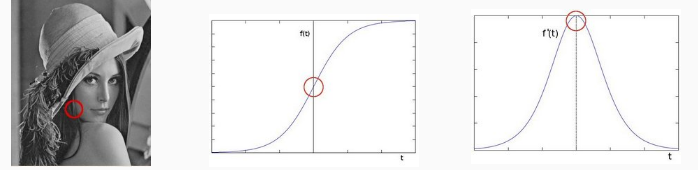
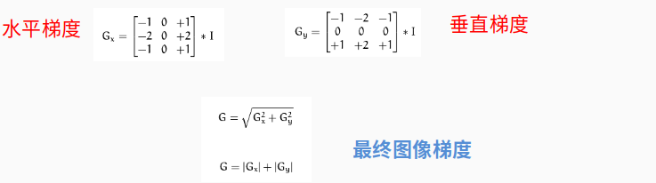
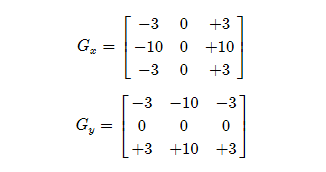
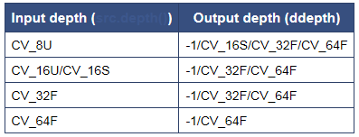

#### 卷积应用-图像边缘提取



原来的曲线，和求导之后的曲线，在变化率比较大的地方，求导，变化最大的地方。没有变化，求导为0（前一个和后一个相减的值）；


- 边缘是什么 **– 是像素值发生跃迁的地方**，是图像的显著特征之一，在图像特征提取、对象检测、模式识别等方面都有重要的作用。
- 如何捕捉/提取边缘 – **对图像求它的一阶导数**
  	  delta =  f(x) – f(x-1)**, delta越大**，**说明像素在X方向变化越大，边缘信号越强**
- 我已经忘记啦，不要担心，用Sobel算子就好！卷积操作！

#### Sobel算子

- 是离散微分算子（discrete differentiation operator），用来**计算图像灰度的近似梯度**
- Soble算子功能集合高斯平滑和微分求导
- 又被称为**一阶微分算子，**求导算子，在**水平和垂直**两个方向上求导，得到图像**X方向与Y方向**梯度图像




- 求取导数的近似值，kernel=3时不是很准确，OpenCV使用改进版本Scharr函数，算子如下：





```
cv::Sobel (
InputArray Src // 输入图像
OutputArray dst// 输出图像，支持如下src.depth() 和 ddepth 的组合
int depth // 输出图像深度.  
Int dx.  // X方向，几阶导数
int dy // Y方向，几阶导数. 
int ksize, SOBEL算子kernel大小，必须是1、3、5、7、
double scale  = 1
double delta = 0
int borderType = BORDER_DEFAULT
```





**API说明cv::Scharr**

当内核为3的时候，Sobel 内核可能产生**比较明显的误差**。（毕竟，Sobel 算子只是求取了导数的近视值而已）。为解决这个问题，opcencv 提供了**Scharr** 函数**，但该函数仅作用于大小为3的内核**。该函数的运算与Sobel 函数一样快，但结果却更加精确。图03


