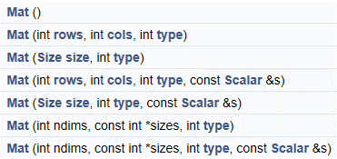

#### Mat对象

一张图片，opencv 会解析成二维数组。里面就是一个一个像素。这些值就存在mat里面。

mat对象 opencv2.0 之后引入的图像数据结构，自动分配内存，不存在内存泄漏的问题，

是面向对象的数据结构，分了两个部分，头部分和数据部分。

**lplImage** : 早起对象，需要开发者自动分配内存，管理内存，容易导致内存泄漏问题。

#### Mat对象构造函数与常用方法



**常用方法：**

```
void copyTo(Mat mat)    完全复制一份
void convertTo(Mat dst, int type) //例如1个八位的转换成浮点数的
Mat clone()  			完全复制一份
int channels()			通道
int depth()              深度
bool empty();            是否是空的
uchar* ptr(i=0)          行指针 i=0 表示第0行。

```


#### 赋值

```
Mat src
src = imread("test.jpg");
Mat dst;
des= Mat(src.size(),src.type());
//创建空白图像，填充色值。
dest = Scalar(127,0,255);

```

#### 通道

```
Mat dst;
cvtColor(src,dst,CV_BGR2GRAY);
print (src.channels());// 3通道
print (dest.channels());// 1通道
```

#### ptr cols,rows

```
int cols = dst.cols;//列
int row = dst.rows; //行
const uchar * firstRow = dst.ptr<uchar>(0);
printf("first pixedl value :%d",*firstRow); //第一个像素的灰度值
```


#### 复杂构造

- **Mat M(2,2,CV_8UC3,Scalar(0,0,255))**

其中前两个参数分别表示（row）跟 （column）,第三个参数

**CV_8UC3种的8表示每个通道占8位，U表示无符号，C表示Char类型，3表示通道数目是3**

第四个参数是向量，**表示初始化每个像素值是多少**，**向量长度对应通道数目一致。**


```
//3*3 的一个像素集合
//每个像素有三个通道 前面连个都是0，最后一个是255
//可以用来验证算法的正确性。
Mat M(3,3,CV_8U3,Scalar(0,0,255)) //
cout <<"M = " <<endl << M<<endl;
[
	0,0,255,0,0,255,0,0,255
	0,0,255,0,0,255,0,0,255
	0,0,255,0,0,255,0,0,255
]
imshow("out",M);//红色图像

```

- **cv::Mat::create实现**

  ```
  Mat M;
  M.create(4, 3, CV_8UC2);
  M = Scalar(127,127);
  cout << "M = " << endl << " " << M << endl << endl;
  uchar* firstRow = M.ptr<uchar>(0);
  printf("%d", *firstRow);
  M = [
      127,127,127,127,127,127,
      127,127,127,127,127,127,
      127,127,127,127,127,127,
      127,127,127,127,127,127
  ]
  ```

  

- **定义小数组**

  ```
  //这里是一个掩膜，用来提高图片的对比度
  //这里char 和 float一样。
  Mat C = (Mat_<float>(3,3) << 0, -1, 0, -1, 5, -1, 0, -1, 0);     
  cout << "C = " << endl << " " << C << endl << endl;
  
  C=[
      0,-1,0
      -1,5,-1
      0,-1,0
  ]
  
  ```

- 初始化纯黑色图片

  ```
  Mat m = Mat::zero(src.size(),src.type())//初始化0
  ```

  

  ​	

#### Mat对象使用

- 部分复制：一般情况下，只会复制Mat对象的头和指针部分，不会复制数据部分。

  ​	例如：Mat A= imread(imgFilePath)

  ​	Mat B(A) //只复制

- 完全复制：如果想把Mat对象的头部和数据部分一起复制，可以通过两个api实现。

  ​	Mat F = A.clone() 或者 Mat G; A.copyTo(G);

  

#### Mat对象使用的四个要点

- 输出图像的内存是自动分配的
- 使用opencv的c++ 接口，不需要考虑内存分配问题
- 赋值操作和拷贝构造函数只会复制头部分
- 使用clone 于copyTo 连个函数实现完全复制


