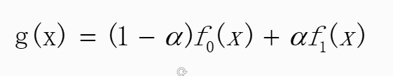

#### 	

#### 线性混合操作

- 

  上图为，线性混合的理论α 代表权重。 y = ax+b; α 范围为0-1之间

  两幅图像，f0(x)和f1(x) ；

  实现方面：主要运用了opencv 种的addWeighted 函数。

- addWeighted 函数 作用是计算两个数组（图像队列）的加权和。

  ​	       

  ```
  void (InputArray src1,double alpha,InputArray src2,double beta,double gamma,OutputArray des ,int  dtype = -1);
  第一个参数：InputArray 类型是src1,表示需要加权的第一个数组，常常填一个Mat;
  第二个参数：double alpha ,表示第一个数组的权重
  第三个参数：src，表示第二个数组，它需要和第一个数组拥有相同的尺寸和通道数。
  第四个参数：double 类型beta ,表示第二个数组的权重值。就是1-alpha
  第五个参数：double gamma,一个加到权重中和上的标量值。校验值：比如：如果两个加起来太暗了，给一个常量值，加上去
  第六个参数：dst输出数组，它和输入的两个数组拥有相同的尺寸和通道数
  第七个参数：int类型dtype,输出阵列的可选深度，有默认值-1。当两个输入数组具有相同的深度时，这个参数设置为-1，既等同于src1.depth();
  
  ```

  

  注意点：**两个图片的大小和类型必须一致才可以。**

  ​	

  表达式：

  ```
  dst= src1[I] *alpha + src2[I]*beta + gamma;
  ```

  其中，I是多维数组元素索引值。而且在遇到多维通道数组的时候，每个通道要独立地进行处理，另外需要注意的是，当输出数组的深度为CV_32S时，这个函数就不适用了，这个时候内存溢出或者结果压根不对。

  ```
  Mat src1, src2, dst;
  	src1 = imread("D:/vcprojects/images/LinuxLogo.jpg");
  	src2 = imread("D:/vcprojects/images/win7logo.jpg");
  	if (!src1.data) {
  		cout << "could not load image Linux Logo..." << endl;
  		return -1;
  	}
  	if (!src2.data) {
  		cout << "could not load image WIN7 Logo..." << endl;
  		return -1;
  	}
  
  	double alpha = 0.5;
  	//两个输入图像必须一致
  	if (src1.rows == src2.rows && src1.cols == src2.cols && src1.type() == src2.type()) {
  		//混合
  		addWeighted(src1, alpha, src2, (1.0 - alpha), 0.0, dst);
  		//相乘结果
  		// multiply(src1, src2, dst, 1.0);
  		
  		imshow("linuxlogo", src1);
  		imshow("win7logo", src2);
  		namedWindow("blend demo", CV_WINDOW_AUTOSIZE);
  		imshow("blend demo", dst);
  	}
  	else {
  		printf("could not blend images , the size of images is not same...\n");
  		return -1;
  	}
  
  	waitKey(0);
  ```

  


