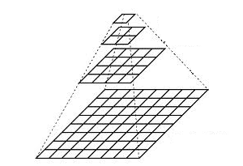

#### 图像金字塔-上采样与降采样

图像金字塔概念

1.  我们在图像处理中常常会调整图像大小，**最常见的就是放大(zoom in)和缩小（zoom out**），尽管几何变换也可以实现图像放大和缩小，但是这里我们介绍图像金字塔

    因为图像处理当中，最常见的就是通过**图像金字塔产生一系列不同分辨率的图像**，在**不同的尺度空间去寻找图片对应的特征**，因为不知道输入的图像到底是一个什么样的图像，**图像的金字塔变换会保证特征一直存在的**。这是**最重要**的一个概念。

2. 一个图像金字塔式一系列的图像组成，**最底下一张是图像尺寸最大**，**最上方的图像尺寸最小**，从空间上从上向下看就想一个古代的金字塔。




#### **高斯金子塔 – 用来对图像进行降采样**

- 高斯金子塔是从底向上，逐层降采样得到。

- 降采样之后图像大小是原图像MxN的M/2 x N/2 ,就是对原图像删除偶数行与列，即得到降采样之后上一层的图片。

- 高斯金子塔的生成过程分为两步：

  ​	对当前层进行高斯模糊

  ​     删除当前层的偶数行与列
  即可得到上一层的图像，这样上一层跟下一层相比，都只有它的1/4大小。

#### **拉普拉斯金字塔 – 用来重建一张图片根据它的上层降采样图片**


#### 高斯不同(Difference of Gaussian-DOG)

- 定义：就是把同一张图像在不同的参数下做高斯模糊之后的结果相减，得到的输出图像。称为高斯不同(DOG)

- 高斯不同是图像的内在特征，在灰度图像增强、角点检测中经常用到。

  高斯不同和高斯金字塔息息相关，因为得到高斯金字塔的第一步，并不是得到这个图像就完事了，对每一层的图像进行模糊,

```
#include <opencv2/opencv.hpp>
#include <iostream>
#include "math.h"

using namespace cv;
int main(int agrc, char** argv) {
	Mat src, dst;
	src = imread("D:/vcprojects/images/cat.jpg");
	if (!src.data) {
		printf("could not load image...");
		return -1;
	}

	char INPUT_WIN[] = "input image";
	char OUTPUT_WIN[] = "sample up";
	namedWindow(INPUT_WIN, CV_WINDOW_AUTOSIZE);
	namedWindow(OUTPUT_WIN, CV_WINDOW_AUTOSIZE);
	imshow(INPUT_WIN, src);

	// 上采样
	pyrUp(src, dst, Size(src.cols*2, src.rows * 2));
	imshow(OUTPUT_WIN, dst);

	// 降采样
	Mat s_down;
	pyrDown(src, s_down, Size(src.cols / 2, src.rows / 2));
	imshow("sample down", s_down);

	// DOG 高斯不同 
	//这里两次高斯模糊
	Mat gray_src, g1, g2, dogImg;
	cvtColor(src, gray_src, CV_BGR2GRAY);
	GaussianBlur(gray_src, g1, Size(5, 5), 0, 0);
	GaussianBlur(g1, g2, Size(5, 5), 0, 0);
	subtract(g1, g2, dogImg, Mat());

	// 归一化显示
	normalize(dogImg, dogImg, 255, 0, NORM_MINMAX);
	imshow("DOG Image", dogImg);

	waitKey(0);
	return 0;
}
```

