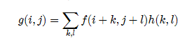
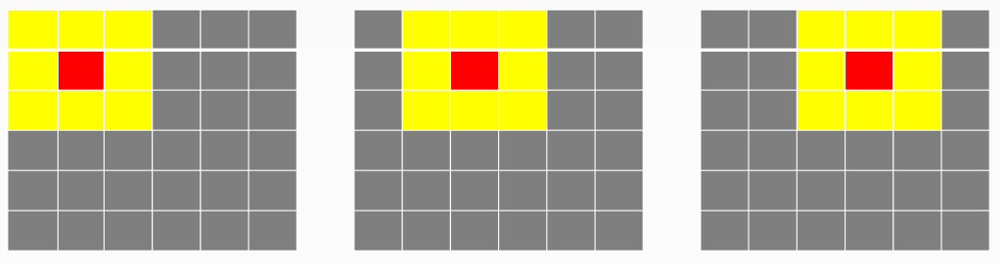
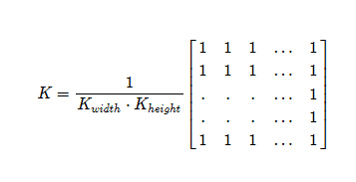
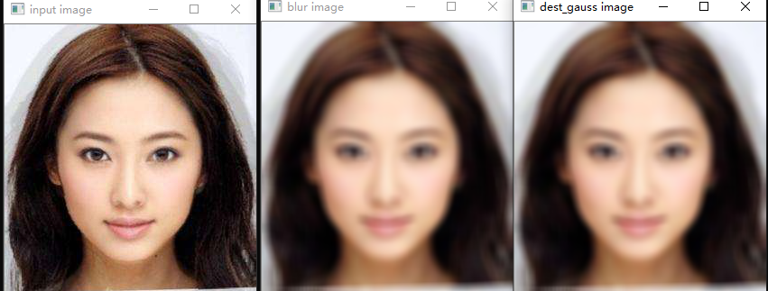
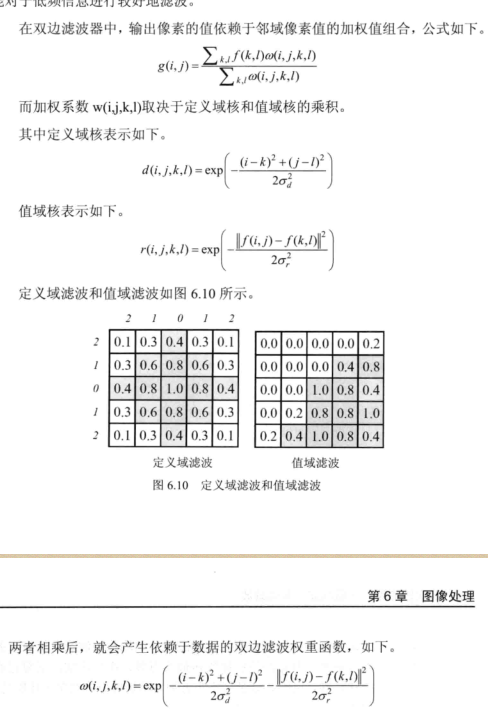
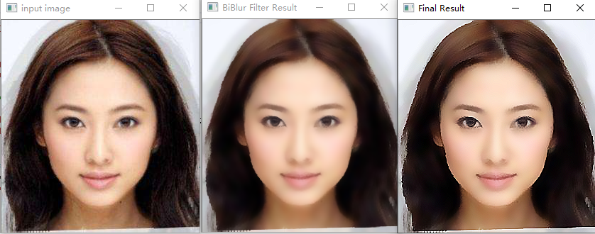

#### 图像的模糊

- **模糊原理**

  - **smooth/Blur** 是图像处理中最简答和常用的操作之一

    平滑处理（smoothing） 也称为模糊处理（bluring）

    使用该操作的原因之一就是为了**给图像预处理时减低噪声**

  - 使用smooth/Blur 操作的背后是数学卷积计算。**通常这些卷积计算都是线性操作，所以又叫线性滤波**。

    

  g(i,j)是输入像素值f(i+k,j+I)的加权和。

  h(k,l)  称为”**卷积核**“，是滤波器的加权系数，既 滤波器的”滤波系数“

  k,l的大小 又称为窗口的大小。

  



假设有6x6的图像像素点矩阵。

**卷积过程**：6x6上面是个3x3的窗口，从左向右，从上向下移动，黄色的每个像个像素点值之和取平均值赋给中心红色像素作为它卷积处理之后新的像素值。**每次移动一个像素格**

- **三种常见的线性滤波**

  方框滤波  boxblur 函数 

  均值滤波 blur函数

  高斯滤波 GaussianBlur 函数

  **线性滤波：即两个信号之和响应和它们各自响应之和相等。换句话说，每个像素的输出值是一些输入像素的加权和。**

#### **均值滤波** （归一化盒子滤波）



**均值滤波 是典型的线性滤波算法，主要方法为邻域平均法，即用一片图像区域的各个像素均值来代替图像中的各个像素值。**

​	  求模板中所有像素的均值，再把均值赋予当前像素（x,y），作为处理后图像在改点上的灰度图像g(x,y).即：

​		**g(x,y) = 1/m∑f(x,y);**  m为改模板中包含当前像素在内的像素总数。

```
blur(Mat src,Mat dst,Size(xradius,yradius),Point(-1,-1));
src:输入图像。待处理的图片深度应该为CV_8U，CV_16U,CV_16S,CV_32F,CV_64F之一。
dst:目标图像，需要和源图像有一样的尺寸和类型
size:内核大小。
point: 类型的anchor,表示锚点（即被平滑的那个点），注意它有默认值Point(-1,-1) 表示这个锚点在中心位置。
第五个参数：borderType ，用于推断图像外部像素的某种边界模式。默认BORDER_DEFAULT 。一般不用管。
```

​	**均值滤波缺陷：**

​		本身存在着固有的缺陷，**即它不能很好的保护图像细节，在图像去噪的同时也破坏了图像的细节部分，从而使图像变得模糊，不能很好地去除噪声点。** 

原来的图像本身很大，**经过高斯滤波之后，值还是很大**。**但是均值滤波的话**：比如当前值很大，周边很小，平均后，也变小了。高斯滤波可以稍微避免了一点点的问题。

**归一化：**归一化就是把要处理的量都缩放到一个范围内，比如（0，1） 以便统一处理和直观量化。

#### 高斯模糊

  **均值模糊很简单，但不是很平滑。高斯模糊就有这个优点**，所以被广泛用在图像降噪上。**特别是在边缘检测之前，都会用来移除细节。**

- **高斯滤波器是一个低通滤波器** ，**高斯模糊就是高斯低通滤波器。**

**线性滤波器的介绍：**

**低通滤波器：允许低频率通过**

**高通滤波器：允许高频率通过**

**带通滤波器：允许一定范围频率通过**

```
GaussianBlur (Mat src,Mat dst,Size(x,y),double sigmax,double sigmay)
x,y都是正数而且是奇数
sigmax:高斯核在x方向的标准偏差。
sigmay:高斯核在y方向上的标准偏差。 如果 sigmaX,sigmaxY都是0，那么由ksize.widh ksize.height 计算出来
int类型的borderType 默认BORDER_DEFAULT 不用管
```
**高斯滤波的问题**
高斯滤波**没有考虑图像的边缘，会将边缘模糊掉**。因为高斯核只考虑了**空间分布**，没有考虑到**像素值**的差异。图像的**边缘往往是图像灰度剧烈变化**的地方。所以可以综合考虑图像灰度因素

下图为均值模糊，高斯模糊 对比 。




源码：

```
#include <opencv2/opencv.hpp>
#include <iostream>
#include <math.h>
using namespace std;
using namespace cv;
int main(int argc, char ** argv) {
	Mat src, dest,dest_gauss;
	src = imread("D:/images/test1.jpg");
	if (!src.data) {
		printf("could not load image ... \n");
		return -1;
	}

	namedWindow("input image", CV_WINDOW_AUTOSIZE);
	imshow("input image", src);
	/*InputArray src, OutputArray dst,
		Size ksize, Point anchor = Point(-1, -1),
		int borderType = BORDER_DEFAULT*/
	blur(src,dest,Size(11,11),Point(-1,-1));
	namedWindow("blur image", CV_WINDOW_AUTOSIZE);
	imshow("blur image", dest);

	GaussianBlur(src, dest_gauss,Size(11,11),11,11);
	namedWindow("dest_gauss image", CV_WINDOW_AUTOSIZE);
	imshow("dest_gauss image", dest_gauss);
	waitKey(0);
	return 0;
}
```


#### 非线性滤波

线性滤波可以实现很多种不同的图像变换，而非线性滤波，如中值滤波，双边滤波，有时候可以达到更好的实现效果。

很多时候，使用邻域非线性滤波会得到更好的效果，比如在噪声是散粒噪声，而不是高斯噪声，即图像偶尔会出现很大值得时候，**用高斯滤波器对图像进行模糊的话，噪声是不会去除的，它们只是转换为更柔和 但仍可见散粒。**

**这就是中值滤波登场的时候了。**

- **中值滤波** 
  - 非线性滤波，**基于统计学**的一种滤波。**基本思想是用像素点邻域灰度值的中值来代替该像素点的灰度值**
  - **统计排序滤波器** 该方法在去除脉冲噪声，椒盐噪声的同时又能保留图像的边缘细节。
  - 把数字图像或数字序列中一点的值用该点的一个邻域中各点值得中值代替，**让周围的像素值接近真实值，从而消除孤立的噪声点。这对于斑点噪声（speckle noise） 和 椒盐噪声（sal-and-pepper noise） 来说尤其有用，因为它不依赖于邻域内那些与典型值差别很大的值**。
  
- **中值滤波和均值滤波比较**
  - 在均值滤波器中，由于**噪声成分被放入平均计算中**，所以输出受到噪声的影响。
  - 但是在中值滤波器中，由于**噪声成分很难选上**，所以几乎不会影响到输出。
  - 在3x3区域中，中值滤波消除的噪声能力更胜一筹。**消除噪声，保留边缘** 都是一个不错的方法
  - 劣势：中值滤波费的时间是均值滤波的**5倍以上**。对一些细节**（特别是细，尖顶等）多的图像**不太适合。

- **双边滤波**
  
  - 高斯双边滤波  ，针对高斯滤波有一些缺点 ，怎么去改善它，很多人会用到美颜软件中去。
  
  -  前述滤波方式基本都只考虑了空间的权重信息,这种情况计算起来比较方便,**但是在边缘信息的处理上存在较大的问题** 
  
  - 双边滤波在计算某一个像素点的新值时,不仅考虑距离信是(**距离越远,权重越小)**,还考虑色彩信息(**色彩差别越大,权重越小**),双边滤波综合考虑距离和色彩的权重结果，既能有效地**去除噪声**,又能够较好地**保护边缘**信息。
  
    
  
  在双边滤波中，当处在边缘时，**与当前点色彩相近的像素点(颜色距离相近)会被给予较大的权重值**:而与当前色彩**差别较大的像素点(颜色距离很远)会被给子较小的权重值**(极端情况下权重可能为 0.直接忽略该点),这样就保护了边缘信息
  
  语法：
  
  ```
  dst=cv2.bilateralFiltert( src, d,sigmaColor, sigmaSpace,borderType）
  
  ```
  
  


| InputArray  | *src***,**                    | **（原始图像：8-bit或floating-point，1-channel或3-channel）** |
| ----------- | ----------------------------- | ------------------------------------------------------------ |
| OutputArray | *dst*,                        | （目标图像：size和type与原始图像相同）                       |
| int         | d                             | （过滤期间使用的**各像素邻域的直径**）                       |
| double      | *sigmaColor*,                 | （色彩空间的sigma参数，该参数较大时，各像素邻域内相距较远的颜色会被混合到一起，从而造成更大范围的半相等颜色） |
| double      | *sigmaSpace*,                 | （坐标空间的sigma参数，该参数较大时，只要颜色相近，越远的像素会相互影响） |
| int         | *borderType*=`BORDER_DEFAULT` | （边界类型：指定如何确定图像范围外的像素的取值（在处理边缘像素时），可参考[BorderTypes](https://docs.opencv.org/3.4.1/d2/de8/group__core__array.html#ga209f2f4869e304c82d07739337eae7c5)） |

- **功能说明**

  双边滤波器可以去除无关噪声，同时保持较好的边缘信息。
  但是，其速度比绝大多数滤波器都慢。
  关于双边滤波，可以参考：Bilateral Filter
  关于2个sigma参数：

  简单起见，可以令2个sigma的值相等；
  如果他们很小（小于10），那么滤波器几乎没有什么效果；
  如果他们很大（大于150），那么滤波器的效果会很强，使图像显得非常卡通化；
  关于参数d：

  过大的滤波器（d>5）执行效率低。
  对于实时应用，**建议取d=5；**
  对于需要过滤严重噪声的离线应用，可取d=9；
  d>0时，由d指定邻域直径；
  d<=0时，d会自动由sigmaSpace的值确定，且d与sigmaSpace成正比；

  参考：link   https://www.jianshu.com/p/a440eb29c334 

1.dst 是返回值,表示进行双边滤波后得到的处理结果
 2.src 是需要处理的图像,即原始图像。它能够有任意数量的通道,并能对各个通道独立处理,图像深度应该是 CV_8U、CV_16U、CV_165、CV_32F 或者 CV_64F 中的一种
 3.d **是在滤波时选取的空间距离参数,这里表示以当前像素点为中心点的直径**。如果该值为非正数,则会自动从参数 sigmaSpace 计算得到。**如果滤波空间较大(d>5),则速度较慢,因此,在实时应用中,推荐 d=5 对于较大噪声的离线滤波,可以选择 d=9**
 4.sigmaColor **是滤波处理时选取的颜色差值范围,该值决定了周围哪些像素点能够参与到滤波中来**。与当前像素点的像素值差值小于 sigmaColor 的像素点,能够参与到当前的滤波中。该值越大,就说明周围有越多的像素点可以参与到运算中,**该值为0时,滤波失去意义:该值为 255时,指定直径内的所有点都能够参与运算**
 5.sigmaSpace **是坐标空间中的 sigma值,它的值越大,说明有越多的点能够参与到滤波计算中来**。当 d=0时,无论 sigmaSpace 的值如何,d 都指定邻域大小:否则,d与 sigmaSpace的值成比例
 6.borderType 是边界样式,该值决定了以何种方式处理边界。一般情况下,不需要考虑该值,直接采用默认值即可

为了简单起见,可以将两个 sigma( sigmaColor 和 sigmaSpace )值设置为相同的。如果它们的值比较小(例如小于 10),滤波的效果将不太明显:如果它们的值较大(例如大于 150)则滤波效果会比较明显,会产生卡通效果




#### 对比总结

均值模糊 **无法克服边缘像素信息丢失缺陷。原因是均值滤波是基于平均权重**

高斯模糊 **部分克服了该缺陷，但是无法完全避免，因为没有考虑像素值的不同**

高斯双边模糊  – **是边缘保留的滤波方法，避免了边缘信息丢失，保留了图像轮廓不变**


```
//medianBlur(src, dst, 3);
	bilateralFilter(src, dst, 15, 100, 5);
```



美颜算法： 先取高斯双边结果，在掩膜操作


```
#include <opencv2/opencv.hpp>
#include <iostream>
#include <math.h>
using namespace std;
using namespace cv;
int main(int argc, char ** argv) {
	Mat src, dst, dest_gauss;
	src = imread("D:/images/test1.jpg");
	if (!src.data) {
		printf("could not load image ... \n");
		return -1;
	}
	namedWindow("input image", CV_WINDOW_AUTOSIZE);
	imshow("input image", src);

	//medianBlur(src, dst, 3);
	bilateralFilter(src, dst, 15, 100, 5);
	namedWindow("BiBlur Filter Result", CV_WINDOW_AUTOSIZE);
	imshow("BiBlur Filter Result", dst);

	Mat resultImg;
	Mat kernel = (Mat_<int>(3, 3) << 0, -1, 0, -1, 5, -1, 0, -1, 0);
	filter2D(dst, resultImg, -1, kernel, Point(-1, -1), 0);
	imshow("Final Result", resultImg);
	waitKey(0);
	return 0;
}
```

