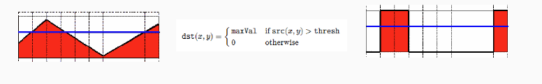
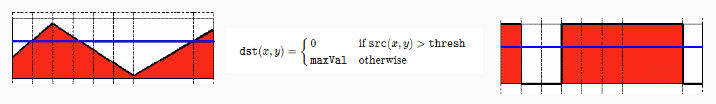
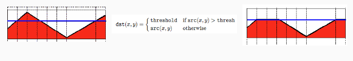
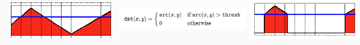
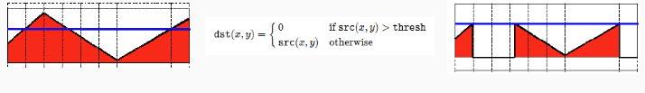
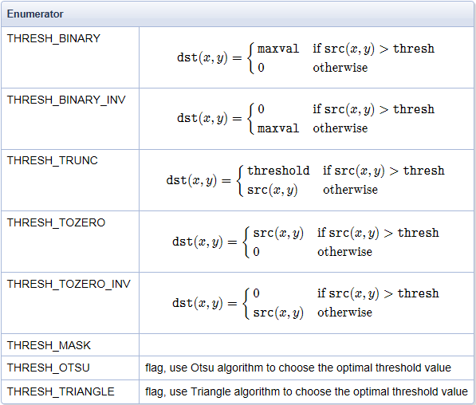

### 基本阈值操作

**阈值** 是什么？简单点说是把图像分割的标尺，这个标尺是根据什么产生的，阈值产生算法？阈值类型。（Binary segmentation）

- **阈值类型 阈值二值化(threshold binary)**

左下方的图表示图像像素点Src(x,y)值分布情况，蓝色水平线表示阈值 



- **阈值类型 阈值反二值化(threshold binary Inverted)**



- **阈值类型一截断 (truncate)**



- **阈值类型一阈值取零**



- **阈值类型一阈值反取零**






threshold 对单通道数组应用固定阈值操作。该函数的典型应用**是对灰度图像进行阈值操作得到二值图像**，（compare() 函数也可以达到此目的）或**者是去掉噪声，例如过滤很小或很大像素值的图像点**。

```
#include <opencv2/opencv.hpp>
#include <iostream>
#include <math.h>

using namespace cv;
Mat src, gray_src, dst;
int threshold_value = 127;
int threshold_max = 255;
int type_value = 2;
int type_max = 4;
const char* output_title = "binary image";
void Threshold_Demo(int, void*);
int main(int argc, char** argv) {
	src = imread("D:/vcprojects/images/test.png");
	if (!src.data) {
		printf("could not load image...\n");
		return -1;
	}
	namedWindow("input image", CV_WINDOW_AUTOSIZE);
	namedWindow(output_title, CV_WINDOW_AUTOSIZE);
	imshow("input image", src);
	
	createTrackbar("Threshold Value:", output_title, &threshold_value, threshold_max, Threshold_Demo);
	createTrackbar("Type Value:", output_title, &type_value, type_max, Threshold_Demo);
	Threshold_Demo(0, 0);

	waitKey(0);
	return 0;
}

void Threshold_Demo(int, void*) {
	//必须是灰度图像
	cvtColor(src, gray_src, CV_BGR2GRAY);
	//	threshold(src, dst, threshold_value, threshold_max, THRESH_BINARY);
	//有时候不知道阈值是什么，指定 THRESH_TRIANGLE 或者 THRESH_OTSU
	threshold(src, dst, 0, 255, THRESH_TRIANGLE | type_value);
	imshow(output_title, dst);
}
```

