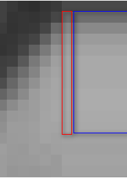

#### 处理边缘

图像的**边缘没法通过卷积完全覆盖**，计算新的值。所以对边缘怎么处理？


**卷积边界问题**

图像卷积的时候**边界像素**，**不能被卷积操作，原因在于边界像素没有完全跟kernel重叠**，所以当3x3滤波时候有1个像素的边缘没有被处理，5x5滤波的时候有2个像素的边缘没有被处理。


#### 处理边缘

在卷积开始之前增加边缘像素，填充的像素值为0或者RGB黑色，比如3x3在
四周各填充1个像素的边缘，这样就确保图像的边缘被处理，在卷积处理之
后再去掉这些边缘。openCV中默认的处理方法是： **BORDER_DEFAULT**，此外
常用的还有如下几种：

 - **BORDER_CONSTANT** – 填充边缘用指定像素值

     常量法就是以一个常量像素值(由参数 value给定)填充扩充的边界值，这种方式在仿射变换，透视变换中非常常见

 - **BORDER_REPLICATE** – 填充边缘像素**用已知的边缘像素值**。

   ​	复制法，也就是复制最边缘像素。

   ​    

   如上图，红色区域为src的最边界像素，蓝色区域是扩充的边界，我们将边缘扩大了5个像素(right=5)，蓝色区域的宽度就是5，复制了5次红色区域的值

   ***\*这种方式也就是OpenCV中的中值滤波medianBlur采用的边界处理方式\****

 - BORDER_WRAP – 用另外一**边的像素来补偿填充**

代码来自源码：filter.cpp

***\**\*/\*
 Various border types, image boundaries are denoted with '|'
\*\* \*\*\* BORDER_REPLICATE:   aaaaaa|abcdefgh|hhhhhhh\*\**\******\*
 \* BORDER_REFLECT:    fedcba|abcdefgh|hgfedcb
 \* BORDER_REFLECT_101:  gfedcb|abcdefgh|gfedcba
 \* BORDER_WRAP:      cdefgh|abcdefgh|abcdefg
 \* BORDER_CONSTANT:    iiiiii|abcdefgh|iiiiiii  with some specified 'i'
 \*/\****

```
#include <opencv2/opencv.hpp>
#include <iostream>
#include <math.h>

using namespace cv;
int main(int argc, char** argv) {
	Mat src, dst;
	src = imread("D:/vcprojects/images/test.jpg");
	if (!src.data) {
		printf("could not load image...\n");
		return -1;
	}
	char INPUT_WIN[] = "input image";
	char OUTPUT_WIN[] = "Border Demo";
	namedWindow(INPUT_WIN, CV_WINDOW_AUTOSIZE);
	namedWindow(OUTPUT_WIN, CV_WINDOW_AUTOSIZE);
	imshow(INPUT_WIN, src);
	/*
	int top = (int)(0.05*src.rows);
	int bottom = (int)(0.05*src.rows);
	int left = (int)(0.05*src.cols);
	int right = (int)(0.05*src.cols);
	RNG rng(12345);
	int borderType = BORDER_DEFAULT;

	int c = 0;
	while (true) {
		c = waitKey(500);
		// ESC
		if ((char)c == 27) {
			break;
		}
		if ((char)c == 'r') {
			borderType = BORDER_REPLICATE;
		} else if((char)c == 'w') {
			borderType = BORDER_WRAP;
		} else if((char)c == 'c') {
			borderType = BORDER_CONSTANT;
		} 
		Scalar color = Scalar(rng.uniform(0, 255), rng.uniform(0, 255), rng.uniform(0, 255));
		copyMakeBorder(src, dst, top, bottom, left, right, borderType, color);
		imshow(OUTPUT_WIN, dst);
	}
	*/

	GaussianBlur(src, dst, Size(5, 5), 0, BORDER_DEFAULT);
	imshow(OUTPUT_WIN, dst);

	waitKey(0);
	return 0;
}
```

