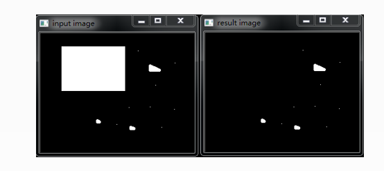

#### 形态学操作

morphologxEx函数，利用基本的膨胀和腐蚀技术，来执行更加高级的形态学变换，如开闭运算，形态学梯度，“顶帽” ，“黑帽” 等。

#### **开操作**

- 其实就是**先腐蚀后膨胀**的过程。
- 数学表达式 dst = open(src,element) = dilate(erode(src,element))
- 开运算**可以用来消除小物体**，在纤细点出分离物体，并且在平滑较大物体的边界的同时**不明显改变其面积**。

​	

#### **闭操作**

- **先膨胀后腐蚀** 

- 数学表达式 dst = close(src,element) = erode(dilate(src,elemnt))

- **能够排除小型黑洞**（黑色区域）

  

#### 形态学梯度

- **膨胀图与腐蚀图之差（又称为基本梯度，其他还包括内部梯度，方向梯度）**

- 数学表达式 dst = morph-grad(src,element) = dilate(src,element)-erode(src,element)

- 对二值图像进行这一操作 可以将团块（blob）的**边缘突出出来**，可以用形态学梯度来**保留边缘轮廓**。

  

#### 顶帽

- 顶帽 又常常被译为“礼帽”运算，是**原图像与开运算的结果之差**

- 数学表达式 tophat(src,element) = src-open(src,element)

- **往往用来分离邻近点亮一些的斑块**。

   

  ​	

#### 黑帽

- 是闭运算的结果与原图之差。
- 数学表达式为：dst = blackhat(src,element) = close(src,element) - src;


#### API

| 标识符         | 含义       |
| -------------- | ---------- |
| MORPH_OPEN     | 开运算     |
| MORPH_CLOSE    | 闭运算     |
| MORPH_GRADIENT | 形态学梯度 |
| MORPH_TOPHAT   | 顶帽       |
| MORPH_BLACKHA  | 黑帽       |
| MORPH_ERODE    | 腐蚀       |
| MORPH_DILAE    | 膨胀       |

```
morphologyEx(src, dest, int op, kernel,intiterations=1,intborderType=BORDER_CONSTANT,constScalar & borderValue=morphologyDefaultBorderValue());

op 见上面的表格。
kernel,borderValue ,constScalar ,intborderType 膨胀腐蚀有介绍过。

```

