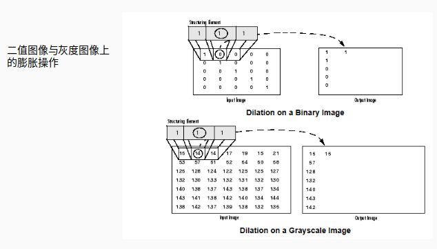
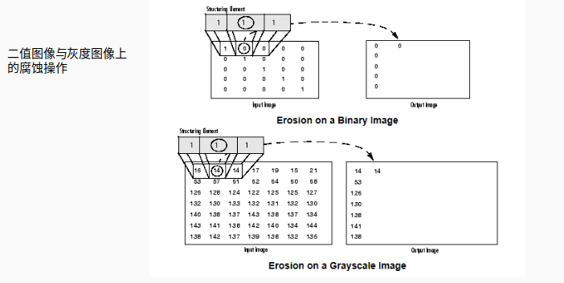
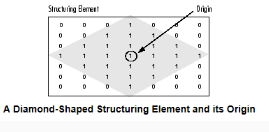
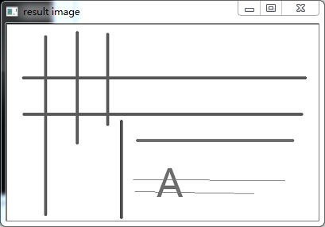
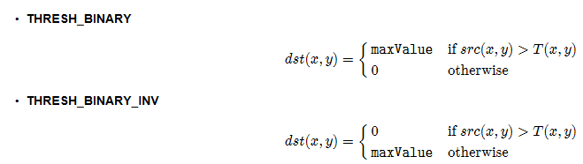
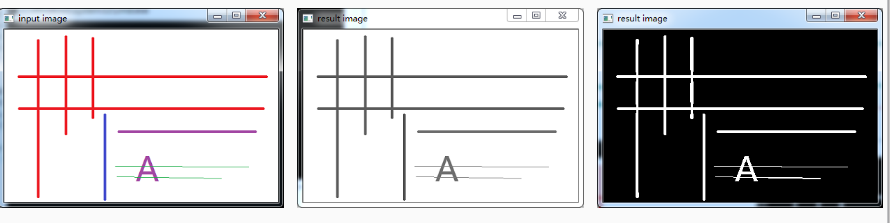

#### 提取水平垂直线

图像形态学操作时候，可以通过自定义的结构元素实现结构元素
对**输入图像一些对象敏感、另外一些对象不敏感，这样就会让敏**
**感的对象改变而不敏感的对象保留输出**。通过使用两个最基本的
形态学操作 – 膨胀与腐蚀，使用不同的结构元素实现对输入图像
的操作、得到想要的结果。

 - **膨胀，输出的像素值是结构元素覆盖下输入图像的最大像素值**
 - **腐蚀，输出的像素值是结构元素覆盖下输入图像的最小像素值**





#### 结构元素

- **上述膨胀与腐蚀过程可以使用任意的结构元素**
- **常见的形状：矩形、园、直线、磁盘形状、砖石形状等各种自定义形状。**





#### **提取步骤**


- **输入图像彩色图像 imread**
- **转换为灰度图像 – cvtColor**
- **转换为二值图像 – adaptiveThreshold**
- **定义结构元素**
- **开操作 （腐蚀+膨胀）提取 水平与垂直线**


#### 转换为灰度图像 – cvtColor



#### 转换为二值图像 – adaptiveThreshold

```
adaptiveThreshold(
Mat src, // 输入的灰度图像
Mat dest, // 二值图像
double maxValue, // 二值图像最大值
int adaptiveMethod // 自适应方法，只能其中之一 – 
		         // ADAPTIVE_THRESH_MEAN_C ， ADAPTIVE_THRESH_GAUSSIAN_C 
int thresholdType,// 阈值类型
int blockSize, // 块大小
double C // 常量C 可以是正数，0，负数
)
```

#### 转换为二值图像 – adaptiveThreshold





#### 定义结构元素

- **一个像素宽的水平线 -  水平长度 width/30**
- **一个像素宽的垂直线 – 垂直长度 height/30**

```
#include <opencv2/opencv.hpp>
#include <iostream>

using namespace cv;
int main(int argc, char** argv) {
	Mat src, dst;
	src = imread("D:/vcprojects/images/chars.png");
	if (!src.data) {
		printf("could not load image...\n");
		return -1;
	}

	char INPUT_WIN[] = "input image";
	char OUTPUT_WIN[] = "result image";
	namedWindow(INPUT_WIN, CV_WINDOW_AUTOSIZE);
	imshow(INPUT_WIN, src);

	Mat gray_src;
	cvtColor(src, gray_src, CV_BGR2GRAY);
	imshow("gray image", gray_src);
	
	Mat binImg;
	adaptiveThreshold(~gray_src, binImg, 255, ADAPTIVE_THRESH_MEAN_C, THRESH_BINARY, 15, -2);
	imshow("binary image", binImg);

	// 水平结构元素
	Mat hline = getStructuringElement(MORPH_RECT, Size(src.cols / 16, 1), Point(-1, -1));
	// 垂直结构元素
	Mat vline = getStructuringElement(MORPH_RECT, Size(1, src.rows / 16), Point(-1, -1));
	// 矩形结构
	Mat kernel = getStructuringElement(MORPH_RECT, Size(3, 3), Point(-1, -1));

	Mat temp;
	erode(binImg, temp, kernel);
	dilate(temp, dst, kernel);
	// morphologyEx(binImg, dst, CV_MOP_OPEN, vline);
	bitwise_not(dst, dst);
	//blur(dst, dst, Size(3, 3), Point(-1, -1));
	imshow("Final Result", dst);

	waitKey(0);
	return 0;
}
```

