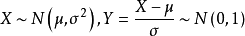
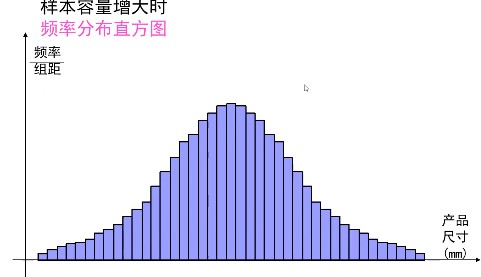
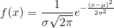
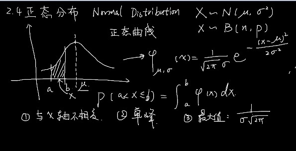
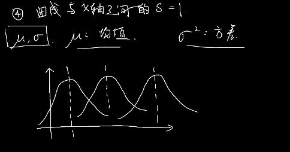
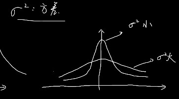

#### 正态分布

noraml distribution 




```
μ表示 （平均数 或者 均值） σ² 表示方差
```

X满足于（N,P） n是试验次数,P是单次试验的概率

实际例子：

产品加工起来肯定有误差产生的。

x轴表示产品的尺寸，这些尺寸又分了多个组，看落在各个组的频率分布情况。

面积表示频率。高度是频率/组距。




这个曲线叫做 ：总体密度曲线。最高值：加工产品要求规格。

在规格附近的生产的产品更多一点。远离规格的要少一点。




x 取值a-b的范围有多大？面积来表示频率。

p(a<x<=b) 的面积。就是微积分。


1，与x轴不相交。

2，单峰。在μ的地方是最大值。

3，最大值是多少？ μ带进去，指数就等于0了。




4，曲线 与 x轴之间的面积 S =1 面积就是概率。

°

μ：均值，也是最大值的位置。σ² 方差。

在改变均值，和方差 图像是怎么变换的呢？


均值改变：只是改变位置。




σ² 大的时候，更分散，小的时候，更集中




3σ 原理：有关于正态曲线面积的一个数值


**落在 μ-σ 与  μ+σ 之间的面积  S1= 0.6826**

**落在 -2σ 与  2σ 之间的面积  S2= 0.9544**

**落在-3 σ 与  3σ 之间的面积是S3 = 0.9974**

**取值 超过3σ  小与 -3σ 之间的面积是 1-S3 = 0.0026**

在单次试验当中，落在3σ 之外的是几乎不可能的。


某次开始，成绩，x是满足正态分布的。

X~N（60 ，8²） 某个人参加考试，考试成绩X位于 52分 68分之间的概率是多少？

这里就可以用到3σ  原理了。

**52=60-8   60+8=68  就是  μ-σ 与  μ+σ 的概率，这个概率就是0.6826。主要看是在1个σ 2个σ 的距离。利用这些已经给出的数值，进行计算。**


