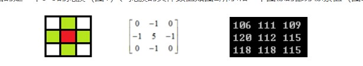

**矩阵的掩膜操作是什么意思：**

#### 获取图像像素的指针

- Mat.ptr<unchar>(int i = 0)获取像素矩阵的指针，索引i表示第几行，从0开始计行数。unchar 代表一个字节    

- 获取当前行指针 const uchar* current = yimage.ptr<uchar>(row); 

- 获取当前像素点（row,col）的值，p(row,col) = current[col];

  #### 

#### 像素范围处理saturate_cast<uchar>

saturate_cast<uchar>（-100），返回 0。

saturate_cast<uchar>（288），返回255

saturate_cast<uchar>（100），返回100

这个函数的功能是确保RGB值得范围在0~255之间

#### 掩膜

**红色是中心像素，从上到下，从左到右对每个像素做同样的处理操作，得到最终结果就是对比度提高之后的输出图像Mat对象**

计算公式：**F(i, j) = 5\*F(i, j) - (F(i - 1, j) + F(i + 1, j) + F(i, j - 1) + F(i, j + 1)**

掩膜操作主要是用来**增加图像的对比度**，在实现掩膜操作的时候需要掩膜（**mask也称为kernel**），一般来讲掩膜都是奇数*奇数如3*3,5*5等。下面给出的是一个3*3的掩膜（图1）、掩膜的具体数值如图2所示和一个图像的部分像素值（图2）



图2中第一行第一列为106，用上图给的掩膜对图3进行操作，就是将图1覆盖到图3上去，对应位置的数值相乘然后求和。

0*106+（-1）*111+0*109+（-1）*120+5*112+（-1）*115+0*118+（-1）*118+0*115=96，将得到的数值替换红色位置的数值，即用96替换112,。替换结束后就完成了一次掩膜操作。


#### **获取图像像素指针**


CV_Assert(myImage.depth() == CV_8U);
Mat.ptr<uchar>(int i=0) 获取像素矩阵的指针， 索引 i 表示第几行， 从 0 开始计行数。
获得当前行指针 const uchar* current= myImage.ptr<uchar>(row );
获取当前像素点 P(row, col)的像素值 p(row, col) =current[col]

#### 像素范围处理 saturate_cast<uchar>


saturate_cast<uchar>（-100）， 返回 0。
saturate_cast<uchar>（288）， 返回 255
saturate_cast<uchar>（100）， 返回 100
这个函数的功能是确保 RGB 值得范围在 0~255 之间

#### 函数调用 filter2D 功能

定义掩膜： Mat kernel = (Mat_<char>(3,3) << 0, -1, 0, -1, 5, -1, 0, -1, 0);
filter2D( src, dst, src.depth(), kernel );其中 src 与 dst 是 Mat 类型变量、 src.depth 表示位图深度， 有 32、 24、 8 等。

depth 可以写-1，和原图一样。

```
/* 矩阵的掩膜操作 */
int image_deal1()
{
Mat src,dst;
src=imread("E:\\1.png"); // 载入图片
if(!src.data)
{
printf("不能加载图片\r\n");
return -1;
} n
amedWindow("test1",CV_WINDOW_AUTOSIZE); // 新建窗口
imshow("test1",src); // 显示图像
// 定义掩膜
Mat kernel = (Mat_<char>(3,3) << 0, -1, 0, -1, 5, -1, 0, -1, 0);
filter2D( src, dst, src.depth(), kernel );
namedWindow("test2"); // 新建窗口
imshow("test2",dst); // 显示图像
waitKey(0);
}
```

#### 通道

**通道表示每个点能存放多少个数，类似于RGB彩色图中的每个像素点有三个值，即三通道的。**

**图片中的深度表示每个值由多少位来存储，是一个精度问题，一般图片是8bit（位）的，则深度是8**

**图像深度是指存储每个像素所用的位数**

**一个图像的通道数是N，就表明每个像素点处有N个数，一个a×b的N通道图像**，其图像矩阵实际上是b行N×a列的数字矩阵。

**OpenCV中图像的通道可以是1、2、3和4。其中常见的是1通道和3通道**，2通道和4通道不常见。

​      **1通道的是灰度图。**

​      **3通道的是彩色图像，比如RGB图像**。

​      **4通道的图像是RGBA**，是RGB加上一个A通道，也叫alpha通道，表示透明度。**PNG图像是一种典型的4通道图像**。**alpha通道可以赋值0到1，或者0到255，表示透明到不透明**。

​      2通道的图像是RGB555和RGB565。2通道图在程序处理中会用到，如傅里叶变换，可能会用到，一个通道为实数，一个通道为虚数，主要是编程方便。RGB555是16位的，2个字节，5+6+5，第一字节的前5位是R，后三位+第二字节是G，第二字节后5位是B，可见对原图像进行压缩了。


**tips3:** **imshow( )显示单通道图像时一定是灰度图**，**如果我们想显示红色的R分量，还是应该按三通道图像显示，只不过G和B通道要赋值成0或255.**

#### 图像类型的转换与显示 


```
Mat image=imread("E:/图片/color.jpg");    
Mat imageGRAY,imageRGBA,imageRGB555;  
cvtColor(image,imageGRAY,CV_RGB2GRAY);            //RGB转GRAY  
cvtColor(image,imageRGBA,CV_RGB2BGRA);            //RGB转RGBA  
cvtColor(image,imageRGB555,CV_RGB2BGR555);        //RGB转RGB555  
  
//来看看通道数  
int n = image.channels();                        //n=3  
int nRGBA = imageRGBA.channels();                //nRGBA = 4  
int nRGB555 = imageRGB555.channels();            //nRGB555 = 2  
  
//显示GRAY、RGB和RGBA图像  
imshow("image",image);  
imshow("imageGRAY",imageGRAY);  
imshow("imageRGBA",imageRGBA);  
//imshow("imageRGB555",imageRGB555);             //无法显示  
```


#### getTickCount

```
计算时间
double t = getTickCount();
double timconsume = (getTickCount()-1)/getTickFrequency();
printf("time consume %.2f",timeconsume);
```

#### Code

```
#include <opencv2/opencv.hpp>
#include <iostream>
#include <math.h>

using namespace cv;

int main(int argc, char** argv) {
	Mat src, dst;
	src = imread("D:/vcprojects/images/test.png");
	if (!src.data) {
		printf("could not load image...\n");
		return -1;
	}
	namedWindow("input image", CV_WINDOW_AUTOSIZE);
	imshow("input image", src);
	
	/*
	int cols = (src.cols-1) * src.channels();
	int offsetx = src.channels();
	int rows = src.rows;

	dst = Mat::zeros(src.size(), src.type());
	for (int row = 1; row < (rows - 1); row++) {
		const uchar* previous = src.ptr<uchar>(row - 1);
		const uchar* current = src.ptr<uchar>(row);
		const uchar* next = src.ptr<uchar>(row + 1);
		uchar* output = dst.ptr<uchar>(row);
		for (int col = offsetx; col < cols; col++) {
			output[col] = saturate_cast<uchar>(5 * current[col] - (current[col- offsetx] + current[col+ offsetx] + previous[col] + next[col]));
		}
	}
	*/
	double t = getTickCount();
	Mat kernel = (Mat_<char>(3, 3) << 0, -1, 0, -1, 5, -1, 0, -1, 0);
	filter2D(src, dst, src.depth(), kernel);
	double timeconsume = (getTickCount() - t) / getTickFrequency();
	printf("tim consume %.2f\n", timeconsume);

	namedWindow("contrast image demo", CV_WINDOW_AUTOSIZE);
	imshow("contrast image demo", dst);

	waitKey(0);
	return 0;
}
```


