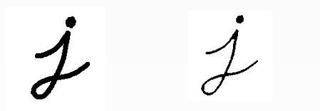
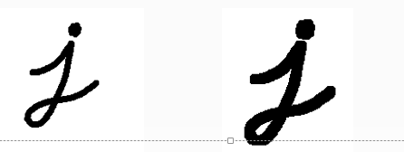

#### **膨胀腐蚀**

-  **形态学操作**
  - 图像形态学操作 – 基于形状的一系列图像处理操作的合集，主要是基于集合论基础上的形态学数学
  - 形态学有四个基本操作：**腐蚀、膨胀、开、闭**
  - 膨胀与腐蚀是图像处理中最常用的形态学操作手段

**形态学操作就是基于形状额一系列图像处理操作。**

- 膨胀与腐蚀能实现多种多样的功能
  - 消除噪声。
  - 分割（isolaet）出独立的图像元素，在图中连接（join）相邻的元素。
  - 寻求图像中的明显的极大值区域极小值区域。
  - 求出图像的梯度。

-  膨胀和腐蚀是**对白色部分（亮度部分）而言**的，不是黑色部分。
-  膨胀：**是对图像亮度部分进行膨胀**，类似于“领域扩张”，效果图比原图有更大的亮度区域。
-  腐蚀：**是原图中的亮度部分被腐蚀**，类似“领域被蚕食”，效果图拥有比原图更小的亮度区域。

#### 膨胀

​    **膨胀（dilate）就是求局部最大值操作**。从数学角度来说，膨胀或者腐蚀操作就是将图像（或图像的一部分区域，称之为A） 与核（称之为B）进行卷积。

​	**核可以是任何形状大小，拥有一个单独定义出来的参考点，我们称为锚点**（anchorption)

​	多数情况下，核实一个小小的，中间带有参考点和实心正方形或者圆盘。其实，**可以把核称为模板或者掩码。**

​	

#### 腐蚀

​	**腐蚀和膨胀是一对相反的操作。所以腐蚀就是求局部最小值得操作。**

​	 **唯一不同的是以最小值替换锚点重叠下图像的像素值**  

​	


#### API

```
 getSructuringElement(int shape,Size ksize,Point point) 返回指定形状和尺寸的结构元素（内核矩阵）。
 参数1：有三种形状可以选择，MORPH_RECT 矩形 ，MORPH_CROSS 交叉形， MORPH_ELLIPSE 椭圆形
 参数2，3分别表示 内核的尺寸以及锚点的位置。
```


  dilate 一般只需要写前三个参数。后面四个都有默认值。

```
void dilate(InputArray src,OutputArray dst,InputArray kernel,Point anchor=Point(-1.-1),
int iterations=1,int borderType=BORDER_CONSTANT,const Scalar* borderValue=morphologyDefaultBorderValue)


src: 输入图像。mat对应即可。通道数是任意的，深度为CV_8U,CV_16U,CV_16S,CV_32F,CV_64F其中之一。
dst:目标图像，和源图像有一样的尺寸类型
kernel : 膨胀操作核。为NULL时，表示的是使用参考点位于中心3x3的核。一般使用getSructuringElement 配合使用
point: 锚点位置，默认值（-1，-1）表示锚位于中心
iterations: 表示dilate次数，默认1。
borderType：用于推断图像外部像素的某种边界模式。默认BODER_DEFAULT
borderValue:一般不用管。


```

erode 函数通dilate 函数一样。

```
Mat src, dst;
char OUTPUT_WIN[] = "output image";
int element_size = 3;
int max_size = 21;
void CallBack_Demo(int, void*);
int main(int argc, char** argv) {
	
	src = imread("D:/vcprojects/images/test1.png");
	if (!src.data) {
		printf("could not load image...\n");
		return -1;
	}
	namedWindow("input image", CV_WINDOW_AUTOSIZE);
	imshow("input image", src);

	namedWindow(OUTPUT_WIN, CV_WINDOW_AUTOSIZE);
	createTrackbar("Element Size :", OUTPUT_WIN, &element_size, max_size, CallBack_Demo);
	CallBack_Demo(0, 0);

	waitKey(0);
	return 0;
}

void CallBack_Demo(int, void*) {
	int s = element_size * 2 + 1;
	Mat structureElement = getStructuringElement(MORPH_RECT, Size(s, s), Point(-1, -1));
	// dilate(src, dst, structureElement, Point(-1, -1), 1);
	erode(src, dst, structureElement);
	imshow(OUTPUT_WIN, dst);
	return;
}
```


