#### 自定义线性滤波


**卷积概念**

卷积是图像处理中一个操作，是kernel在图像的每个像素上的操作。
Kernel本质上一个**固定大小的矩阵数组**，**其中心点称为锚点(anchor point)**

**卷积如何工作**

把kernel放到像素数组之上，**求锚点周围覆盖的像素乘积之和（包括锚点**），用来替换**锚点覆盖下像素点值**称为卷积处理。数学表达如下：

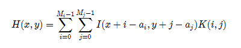

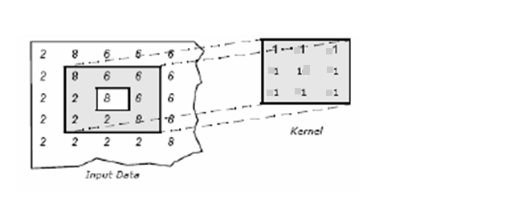

```
Sum = 8x1+6x1+6x1+2x1+8x1+6x1+2x1+2x1+8x1
New pixel = sum / (m*n)
```

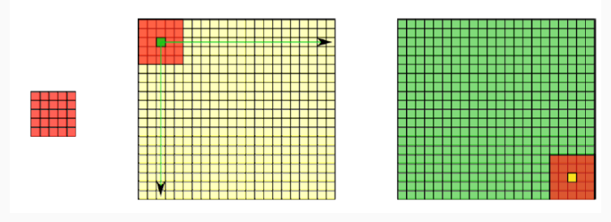


卷积一般有三个作用，**1，模糊图像，2，提取边缘 3，图像的增显，锐化**。常见的卷积有这三个作用。


#### 常见算子

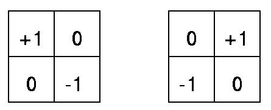

​																					**Robert算子**


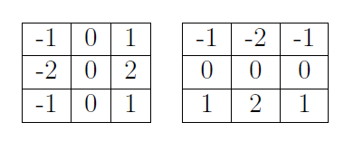

​																					**Sobel算子**

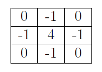

​																					              **拉普拉斯算子**


```
#include <opencv2/opencv.hpp>
#include <iostream>
#include <math.h>

using namespace cv;
int main(int argc, char** argv) {
	Mat src, dst;
	int ksize = 0;

	src = imread("D:/vcprojects/images/test1.png");
	if (!src.data) {
		printf("could not load image...\n");
		return -1;
	}

	char INPUT_WIN[] = "input image";
	char OUTPUT_WIN[] = "Custom Blur Filter Result";
	namedWindow(INPUT_WIN, CV_WINDOW_AUTOSIZE);
	namedWindow(OUTPUT_WIN, CV_WINDOW_AUTOSIZE);

	imshow(INPUT_WIN, src);
	
	
	//Robert X 方向
	
	 Mat kernel_x = (Mat_<int>(2, 2) << 1,0,0,-1);
	 filter2D(src, dst, -1, kernel_x, Point(-1, -1), 0.0);
	
	//Robert Y 方向
	
	 Mat kernel_y = (Mat_<int>(2, 2) << 0,1,-1,0);
	  filter2D(src, dst, -1, kernel_y, Point(-1, -1), 0.0);
	
	// Sobel X 方向
	// Mat kernel_x = (Mat_<int>(3, 3) << -1, 0, 1, -2,0,2,-1,0,1);
	// filter2D(src, dst, -1, kernel_x, Point(-1, -1), 0.0);

	// Sobel Y 方向
	// Mat yimg;
	// Mat kernel_y = (Mat_<int>(3, 3) << -1, -2, -1, 0,0,0, 1,2,1);
	// filter2D(src, yimg, -1, kernel_y, Point(-1, -1), 0.0);

	// 拉普拉斯算子
	//Mat kernel_y = (Mat_<int>(3, 3) << 0, -1, 0, -1, 4, -1, 0, -1, 0);
	//filter2D(src, dst, -1, kernel_y, Point(-1, -1), 0.0);
	int c = 0;
	int index = 0;
	while (true) {
		c = waitKey(500);
		if ((char)c == 27) {// ESC 
			break;
		}
		ksize = 5 + (index % 8) * 2;
		Mat kernel = Mat::ones(Size(ksize, ksize), CV_32F) / (float)(ksize * ksize);
		filter2D(src, dst, -1, kernel, Point(-1, -1));
		index++;
		imshow(OUTPUT_WIN, dst);	
	}

	// imshow("Sobel Y", yimg);
	return 0;
}
```

​                                                                             原图

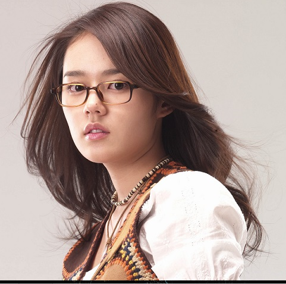


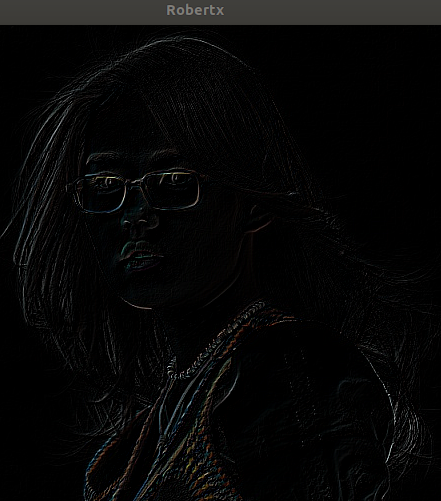


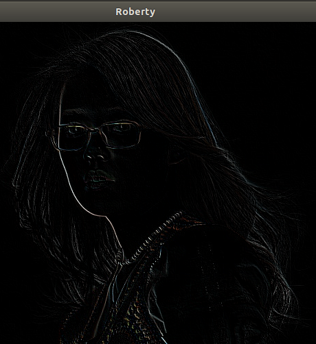

图像的差异得到了最大的体现，把这两个图像合起来，得到图像的整个轮廓。x梯度和y方向的梯度。


Sobel 算子也可以做梯度算子。 Sobel 差异


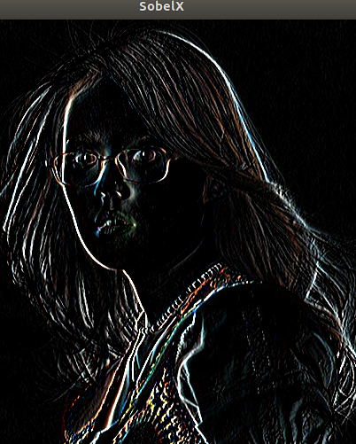

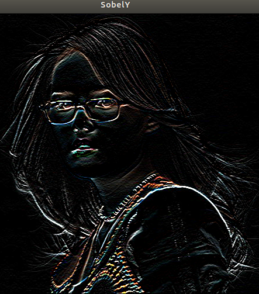


**拉普拉斯算子 获取主要的轮廓**


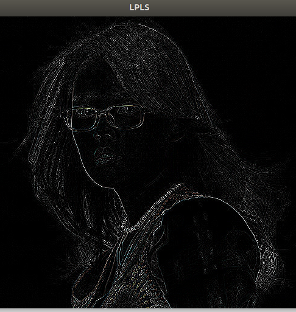

#### 自定义卷积模糊

```
filter2D方法filter2D(
Mat src, //输入图像
Mat dst, // 模糊图像
int depth, // 图像深度32/8
Mat kernel, // 卷积核/模板
Point anchor, // 锚点位置
double delta // 计算出来的像素+delta
)
其中 kernel是可以自定义的卷积核
```

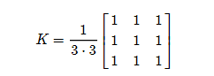


```
逐渐模糊的demo
int c = 0;
int index = 0;
while (true) {
   c = waitKey(500);
   if ((char)c == 27) {// ESC 
      break;
   }
   ksize = 5 + (index % 8) * 2;
   Mat kernel = Mat::ones(Size(ksize, ksize), CV_32F) / (float)(ksize * ksize);
   filter2D(src, dst, -1, kernel, Point(-1, -1));
   index++;
   imshow(OUTPUT_WIN, dst);   
}
```


