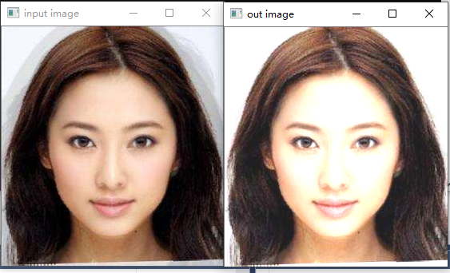

#### 提高图像的亮度与对比度

- **理论图像的变换可以看做如下：**

  - 像素变换-点操作
  - 邻域操作-区域  做图像的卷积。**整体特征的提取，图像梯度的计算，模式匹配识别，等前期的处理，模糊，平滑等。

  **而调节图像的亮度与对比度 属于点操作。**

   

  ```
  	g(i,j) = αf(i,j) + β 其中α>0,β是增益变量。 opencv 是基于rgb 的，必须是正数。
  ```

  f(i,j)表源图像像素。

  g(i,j)表示输出图像像素。

  **β称为偏置（bias），常常用来控制图像的亮度**。白话理解： 像素值越白，越亮，像素值越大，亮度就给增益变量加大。

  **α 大于0，被称为增益（gain）.常常被用来控制图像的对比度**。

- **重要的api**

  ​	Mat new_image = Mat::zeros( image.size(), image.type() ); **创建一张跟原图像大小和类型一致的空白图像、像素值初始化为0**

  

  ​	 saturate_cast<uchar>(value**)确保值大小范围为0~255之间**

  

  ​	Mat.at<Vec3b>(y,x)[index]=value **给每个像素点每个通道赋值**


如图：





```
Mat src, dest;
	src = imread("D:/images/test1.jpg");
	if (!src.data) {
		printf("could not load image ... \n");
		return -1;
	}

	namedWindow("input image", CV_WINDOW_AUTOSIZE);
	imshow("input image", src);
	int height = src.rows;
	int width = src.cols;
	dest = Mat::zeros(src.size(),src.type());
	float alpha = 1.2;
	float beta = 30;
	for (int row = 0; row < height;row++) {
		for (int col = 0;col < width; col++) {
			if (src.channels()==3) {
				float b = src.at<Vec3b>(row, col)[0];
				float g = src.at<Vec3b>(row, col)[1];
				float r = src.at<Vec3b>(row, col)[2];
				dest.at<Vec3b>(row, col)[0] = saturate_cast<uchar>(b*alpha+beta);
				dest.at<Vec3b>(row, col)[1] = saturate_cast<uchar>(g*alpha + beta);
				dest.at<Vec3b>(row, col)[2] = saturate_cast<uchar>(r*alpha + beta);
			}
			else if (src.channels() ==1) {
				float v = src.at<uchar>(row,col);
				dest.at<uchar>(row, col) = saturate_cast<uchar>(v*alpha+beta);
			}
		}
	}
	namedWindow("out image", CV_WINDOW_AUTOSIZE);
	imshow("out image", dest);
	waitKey(0);
	return 0;
```

#### 3b转3F

这里的代码 也可以是用Vec3f 来转换。使用之前要convertTo 。 同样的效果。

```
Mat src, dest;
	src = imread("D:/images/test1.jpg");
	if (!src.data) {
		printf("could not load image ... \n");
		return -1;
	}

	namedWindow("input image", CV_WINDOW_AUTOSIZE);
	imshow("input image", src);
	int height = src.rows;
	int width = src.cols;
	dest = Mat::zeros(src.size(),src.type());
	float alpha = 1.2;
	float beta = 30;
	Mat m1;
	src.convertTo(m1,CV_32F);
	for (int row = 0; row < height;row++) {
		for (int col = 0;col < width; col++) {
			if (src.channels()==3) {
				float b = m1.at<Vec3f>(row, col)[0];
				float g = m1.at<Vec3f>(row, col)[1];
				float r = m1.at<Vec3f>(row, col)[2];
				dest.at<Vec3b>(row, col)[0] = saturate_cast<uchar>(b*alpha+beta);
				dest.at<Vec3b>(row, col)[1] = saturate_cast<uchar>(g*alpha + beta);
				dest.at<Vec3b>(row, col)[2] = saturate_cast<uchar>(r*alpha + beta);
			}
			else if (src.channels() ==1) {
				float v = src.at<uchar>(row,col);
				dest.at<uchar>(row, col) = saturate_cast<uchar>(v*alpha+beta);
			}
		}
	}
	namedWindow("out image", CV_WINDOW_AUTOSIZE);
	imshow("out image", dest);
	waitKey(0);
	return 0;
```


