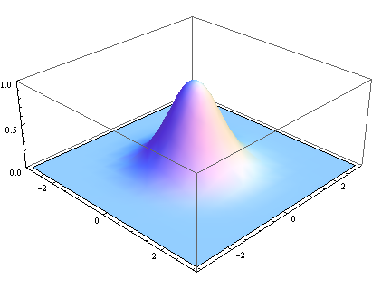

####  高斯模糊

注：这篇文章通俗易懂。大致摘抄下来，作为笔记。

link: http://www.ruanyifeng.com/blog/2012/11/gaussian_blur.html 

所谓"模糊"，可以理解成每一个像素都取周边像素的平均值 

 上图中，2是中间点，周边点都是1。 

 

"中间点"取"周围点"的平均值，就会变成1。**在数值上，这是一种"平滑化"。在图形上，就相当于产生"模糊"效果，"中间点"失去细节**。 

上面分别是原图、模糊半径3像素、模糊半径10像素的效果。**模糊半径越大，图像就越模糊。从数值角度看，就是数值越平滑。**

接下来的问题就是，既然每个点都要取周边像素的平均值，那么应该如何分配权重呢？

 如果使用简单平均，显然不是很合理，**因为图像都是连续的，越靠近的点关系越密切，越远离的点关系越疏远。因此，加权平均更合理，距离越近的点权重越大，距离越远的点权重越小**。 

####  

#### **正态分布的权重** 

 正态分布显然是一种可取的权重分配模式。 

 在图形上，正态分布是一种钟形曲线，越接近中心，取值越大，越远离中心，取值越小 

 计算平均值的时候，我们只需要将"中心点"作为原点，其他点按照其在正态曲线上的位置，分配权重，就可以得到一个加权平均值。 

#### 高斯函数

 上面的正态分布是一维的，图像都是二维的，所以我们需要二维的正态分布。 

 **四、权重矩阵** 

 假定中心点的坐标是（0,0），那么距离它最近的8个点的坐标如下 

更远的点以此类推。

为了计算权重矩阵，需要设定σ的值。假定σ=1.5，则模糊半径为1的权重矩阵如下：

 这9个点的权重总和等于0.4787147，如果只计算这9个点的加权平均，还必须让它们的权重之和等于1，因此上面9个值还要分别除以0.4787147，得到最终的权重矩阵。 

#### **计算高斯模糊**

有了权重矩阵，就可以计算高斯模糊的值了。

假设现有9个像素点，灰度值（0-255）如下：

 每个点乘以自己的权重值： 

 得到 

**将这9个值加起来，就是中心点的高斯模糊的值**。

**对所有点重复这个过程，就得到了高斯模糊后的图像。如果原图是彩色图片，可以对RGB三个通道分别做高斯模糊。**

link: http://www.ruanyifeng.com/blog/2012/11/gaussian_blur.html 